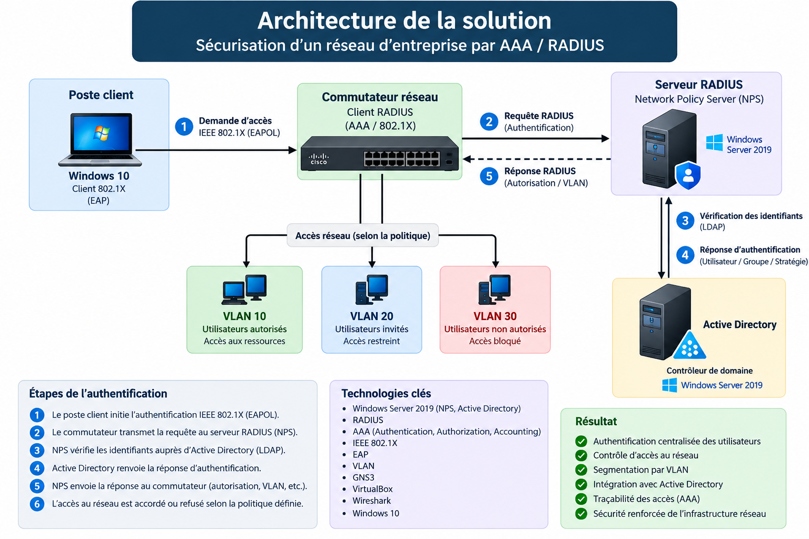
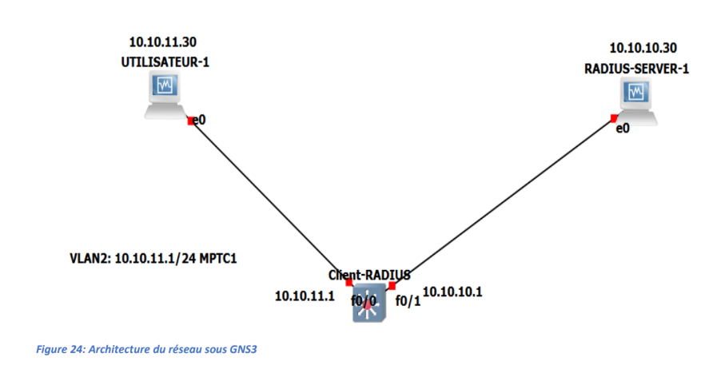
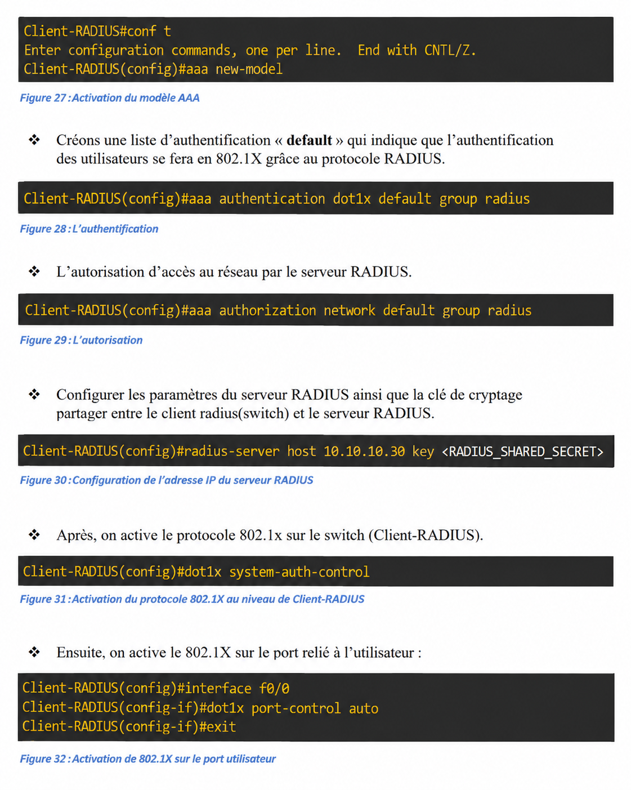
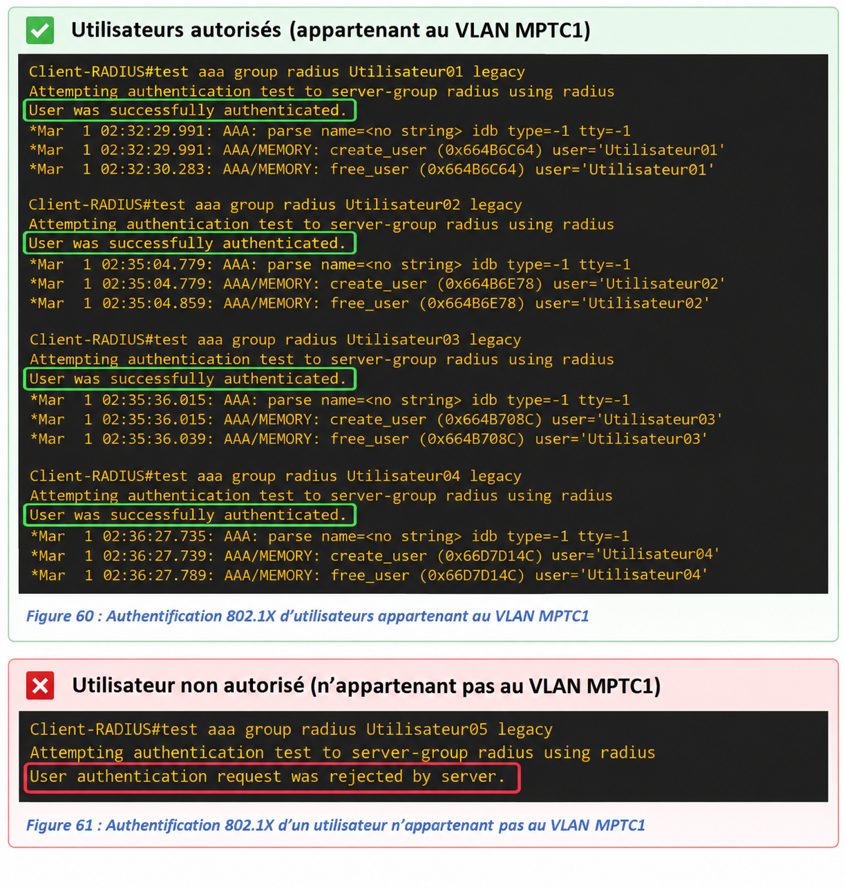
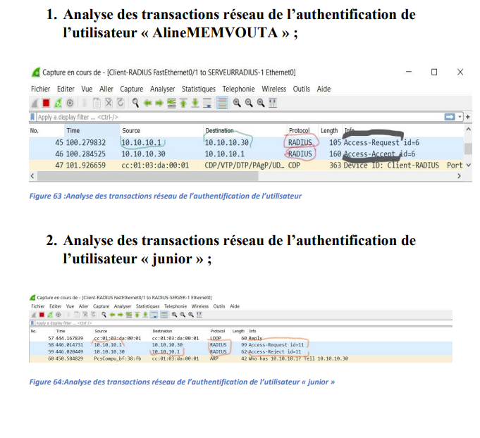
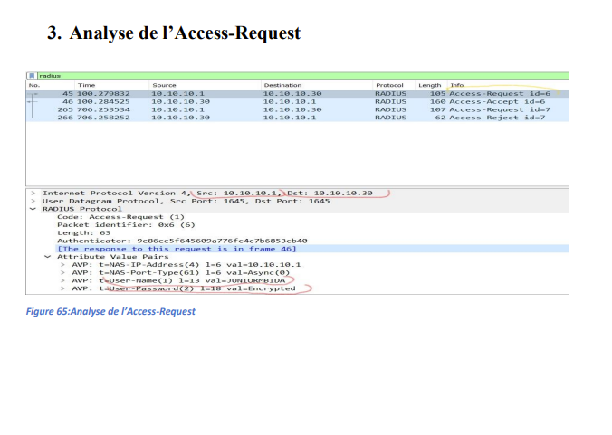

# Sécurisation d’un réseau d’entreprise par AAA/RADIUS

## Présentation du projet

Ce projet porte sur le renforcement de la sécurité du système d’information du **Ministère des Postes et Télécommunications (MINPOSTEL)** par la mise en place d’une solution centralisée de contrôle d’accès réseau.

La solution repose sur le modèle **AAA (Authentication, Authorization and Accounting)** et le protocole **RADIUS**, associés au standard **IEEE 802.1X** et au protocole **EAP**.

L’objectif principal était de permettre l’authentification et l’autorisation des utilisateurs avant leur accès aux ressources du réseau.

---

## Objectifs

- Analyser les besoins de sécurité liés à l’accès au réseau.
- Mettre en place une authentification centralisée avec **RADIUS**.
- Intégrer le serveur RADIUS à **Active Directory**.
- Configurer le modèle **AAA** sur l’équipement réseau.
- Mettre en œuvre l’authentification réseau **IEEE 802.1X**.
- Utiliser les **VLAN** et les politiques réseau pour contrôler les accès.
- Tester les accès d’utilisateurs autorisés et non autorisés.
- Vérifier le fonctionnement de l’authentification à l’aide de **Wireshark**.

---

##  Technologies utilisées

| Technologie | Utilisation |
|---|---|
| Windows Server 2019 | Infrastructure serveur |
| Active Directory | Gestion centralisée des utilisateurs |
| Network Policy Server (NPS) | Serveur RADIUS |
| RADIUS | Authentification réseau centralisée |
| AAA | Authentification, autorisation et traçabilité |
| IEEE 802.1X | Contrôle d’accès au réseau |
| EAP | Mécanisme d’authentification |
| VLAN | Segmentation et contrôle d’accès |
| GNS3 | Simulation de l’infrastructure réseau |
| VirtualBox | Virtualisation |
| Wireshark | Analyse du trafic réseau |
| Windows 10 | Poste client |

---

##  Architecture de la solution

Le système repose sur une architecture d’authentification centralisée centralisée permettant de contrôler l’accès au réseau à l’aide de RADIUS, IEEE 802.1X et Active Directory :

##  Mise en œuvre

### 1. Création de l’environnement réseau

L’environnement de test a été construit à l’aide de **GNS3** et de la virtualisation.

La topologie ci-dessous présente l’environnement utilisé pour tester la communication entre le poste utilisateur, le client RADIUS et le serveur RADIUS.

### 2. Configuration AAA, RADIUS et IEEE 802.1X

Le modèle **AAA (Authentication, Authorization and Accounting)** a été configuré sur le commutateur afin de centraliser l’authentification et l’autorisation des utilisateurs via le serveur **RADIUS**.

La configuration réalisée comprend :
- l’activation du modèle AAA ;
- l’authentification IEEE 802.1X via RADIUS ;
- l’autorisation d’accès au réseau via RADIUS ;
- la déclaration du serveur RADIUS ;
- l’activation globale du protocole IEEE 802.1X ;
- l’activation de 802.1X sur le port relié à l’utilisateur.

> 🔒 **Sécurité :** le secret partagé RADIUS utilisé dans l’environnement original a été volontairement masqué dans cette documentation.

### 3. Tests d’authentification et validation

Afin de valider le fonctionnement de la solution, des tests d’authentification ont été réalisés avec différents utilisateurs.

#### ✅ Utilisateur autorisé

Les utilisateurs autorisés ont été authentifiés avec succès par le serveur RADIUS, confirmant le bon fonctionnement de l’authentification centralisée.

#### ❌ Utilisateur non autorisé

Un test a également été effectué avec un utilisateur ne répondant pas aux conditions d’accès définies. La demande d’authentification a été rejetée par le serveur RADIUS.

Ces tests permettent de vérifier que la solution distingue correctement les utilisateurs autorisés des utilisateurs non autorisés selon les politiques d’accès configurées.

### 4. Analyse du trafic avec Wireshark

Afin de vérifier les échanges entre le client RADIUS et le serveur,
le trafic réseau a été capturé et analysé avec **Wireshark**.

L’analyse met notamment en évidence les messages du protocole RADIUS :

- **Access-Request** : demande d’authentification envoyée au serveur RADIUS ;
- **Access-Accept** : authentification acceptée par le serveur ;
- **Access-Reject** : authentification refusée par le serveur.

#### Analyse des transactions RADIUS

Les captures suivantes montrent la différence entre une authentification
acceptée et une authentification rejetée.

#### Analyse d’un paquet Access-Request

L’inspection détaillée d’un paquet **Access-Request** permet d’observer
les informations échangées entre le client et le serveur RADIUS lors
d’une tentative d’authentification.

Cette analyse confirme le fonctionnement des mécanismes
d’authentification et permet de valider les résultats observés lors
des tests d’accès.

